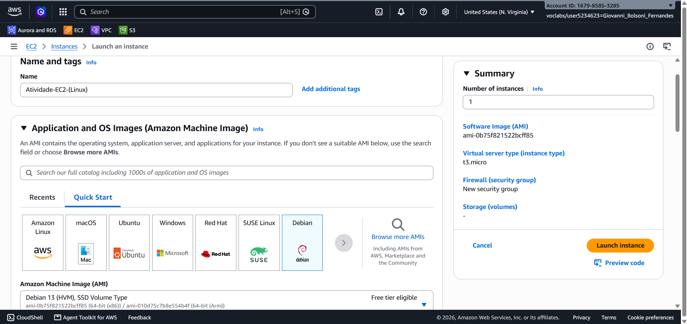
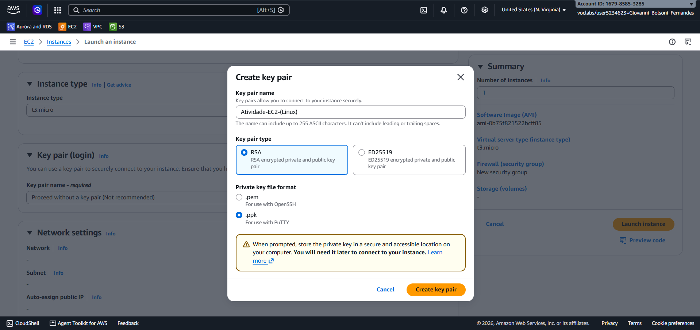
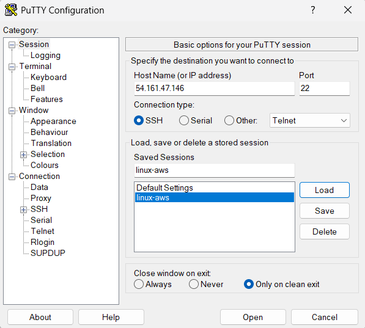
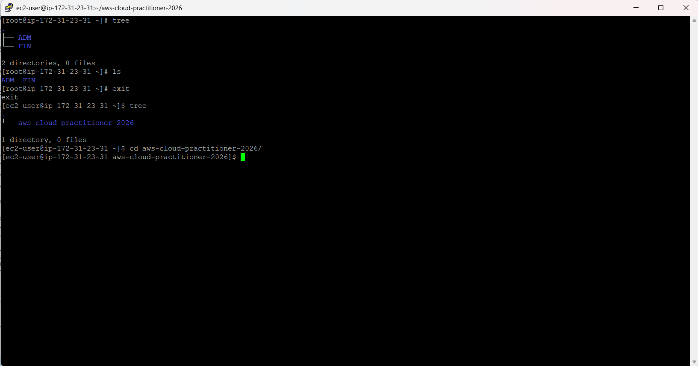
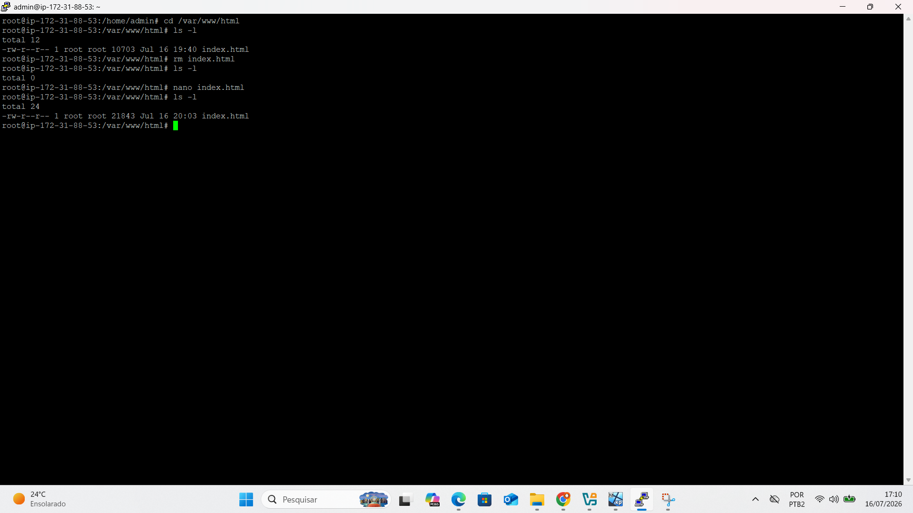
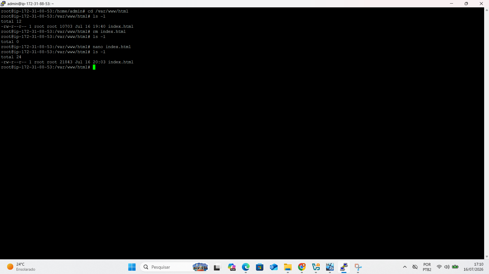
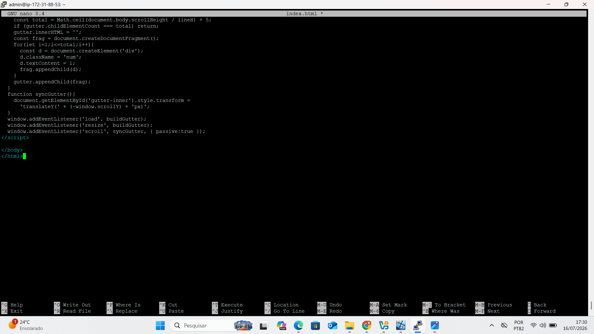

# Atividade 01 — Servidor Web no Linux Debian (EC2 + Apache)

## Objetivo

Criar uma instância EC2 com Linux Debian, acessar via SSH (PuTTY), instalar o Apache e publicar um site simples acessível pelo IP público da instância.

## Etapas realizadas

### 1. Criação da instância EC2
Instância do tipo `t3.micro` criada com a imagem **Debian 13 (HVM)**, através do console da AWS (serviço EC2).

### 2. Criação do par de chaves (Key Pair)
Para acesso seguro via SSH, foi gerado um par de chaves no formato `.ppk` (compatível com PuTTY), do tipo RSA.

### 3. Acesso via PuTTY
Conexão SSH realizada através do PuTTY, usando o IP público da instância na porta 22.

### 4. Navegação nos diretórios
Após o acesso, foi feita a exploração da estrutura de diretórios do servidor (uso de `tree`, `ls`, navegação entre pastas do projeto).

### 5. Instalação do Apache
O servidor web **Apache** foi instalado na instância Linux.

### 6. Edição do site (index.html)
O arquivo `index.html`, localizado em `/var/www/html`, foi editado diretamente no servidor usando o editor `nano`.

### 7. Arquivo finalizado
Conteúdo final do `index.html` revisado antes da publicação.

### 8. Site no ar
Site publicado e acessível através do IP público da instância EC2.

## Aprendizados

- Como provisionar uma instância Linux na EC2
- Como gerar e usar Key Pairs para acesso SSH
- Como se conectar via PuTTY
- Comandos básicos de navegação em Linux (`ls`, `cd`, `tree`)
- Como instalar e configurar o Apache
- Como editar arquivos diretamente no servidor via terminal (`nano`)
