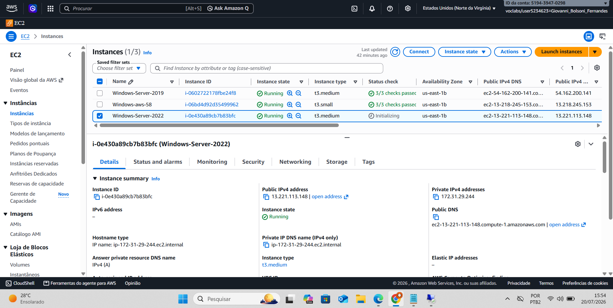
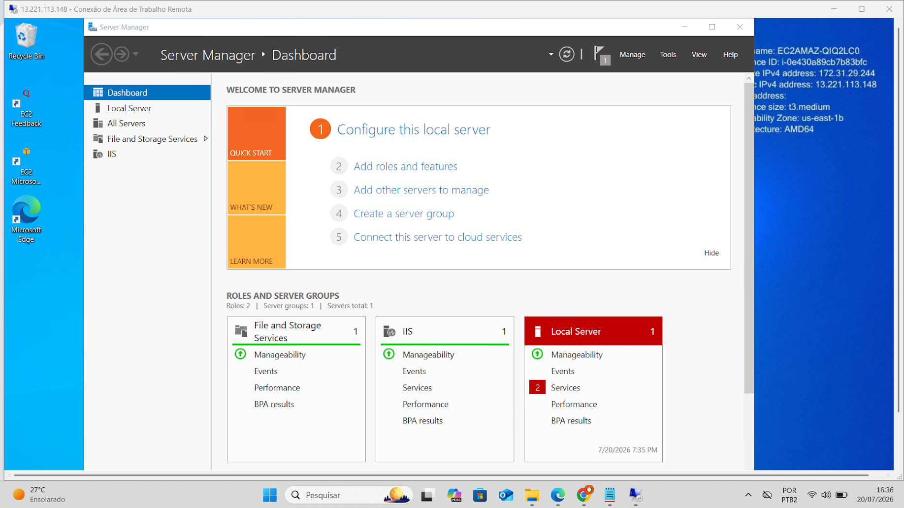
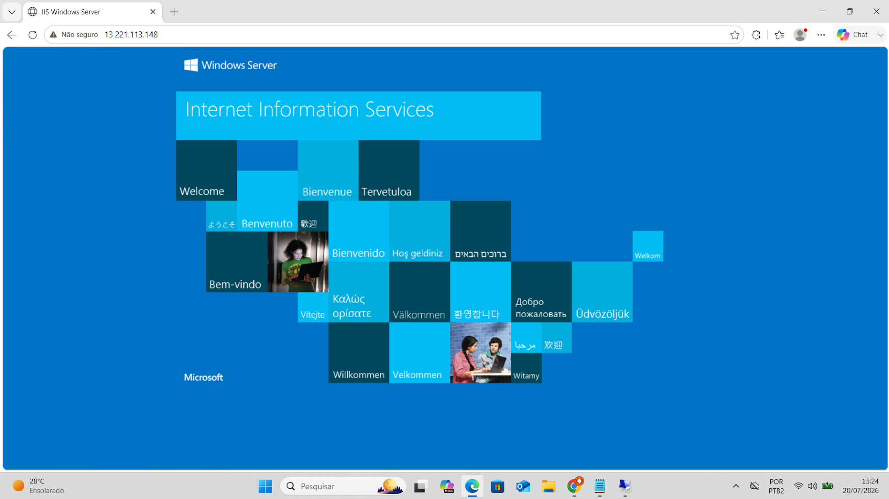
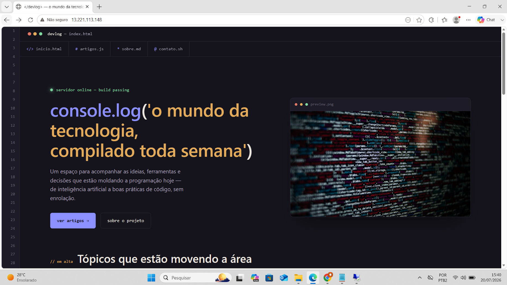

# Atividade 02 — Servidor Web no Windows Server (EC2 + IIS)

## Objetivo

Criar uma instância EC2 com Windows Server, instalar o serviço IIS (Internet Information Services) e publicar um site simples acessível pelo IP público da instância.

## Etapas realizadas

### 1. Criação da instância EC2
Instância do tipo `t3.medium` criada com a imagem **Windows Server 2022**, através do console da AWS (serviço EC2).

### 2. Instalação do IIS
Após conectar na instância via Área de Trabalho Remota (RDP), o papel de servidor **IIS (Internet Information Services)** foi adicionado através do *Server Manager*, junto com o serviço de *File and Storage Services*.

### 3. Validação da página padrão do IIS
Com o serviço instalado e rodando, acessei o IP público da instância pelo navegador e confirmei a página de boas-vindas padrão do IIS, sinal de que o servidor web estava ativo.

### 4. Publicação do site
Por fim, o conteúdo do site (`index.html`) foi publicado na pasta padrão do IIS e ficou acessível publicamente pelo IP da instância.

## Aprendizados

- Como provisionar uma instância Windows na EC2
- Como instalar e configurar o papel IIS via Server Manager
- Como validar que um servidor web está publicamente acessível
