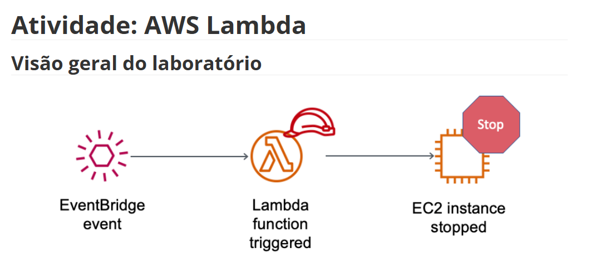
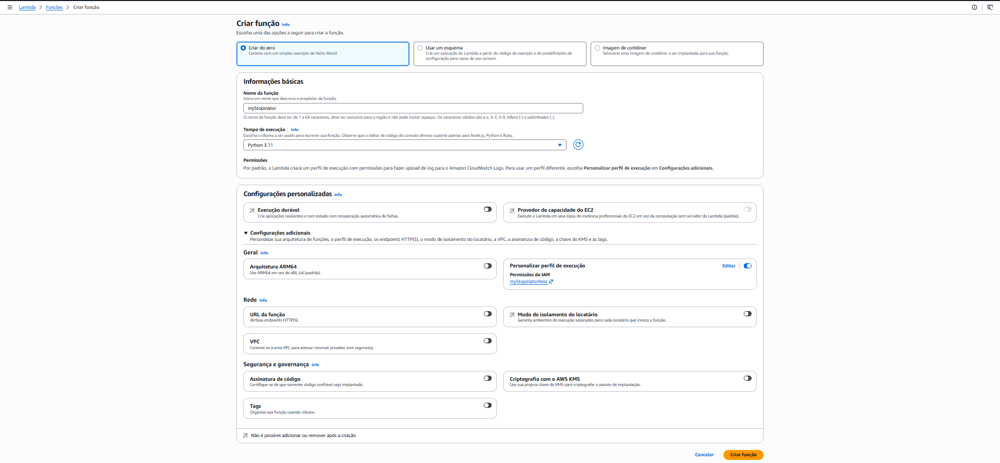
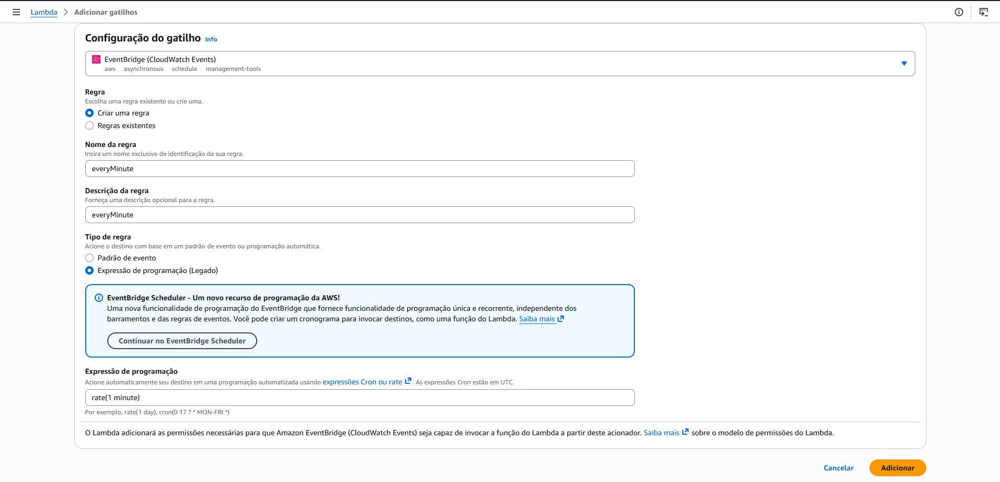
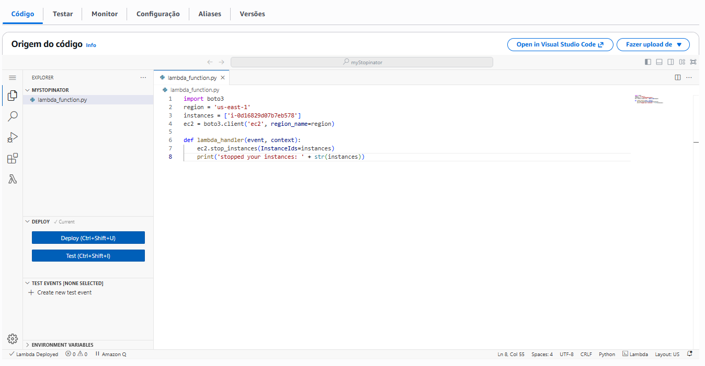
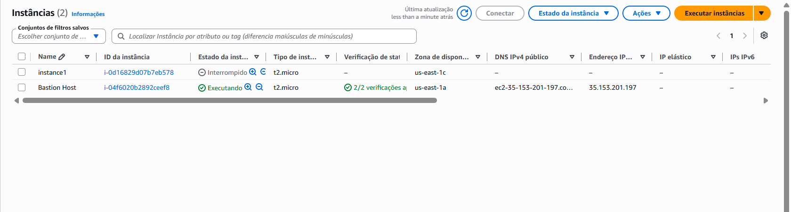

# Atividade 03 — Parando instâncias EC2 automaticamente com AWS Lambda

## Objetivo

Criar uma função **AWS Lambda** que para instâncias EC2 automaticamente, acionada por um gatilho agendado no **Amazon EventBridge** — simulando uma rotina de economia de custos (desligar recursos ociosos).

## Visão geral do laboratório

O fluxo é simples: um evento do EventBridge dispara a função Lambda em um intervalo definido, e a função interrompe (`stop`) as instâncias EC2 especificadas.

```
EventBridge (evento agendado) ──▶ Lambda (função acionada) ──▶ EC2 (instância parada)
```



## Etapas realizadas

### 1. Criação da função Lambda
Função `myStopinator` criada do zero, usando o runtime **Python 3.11**, com uma role de execução personalizada (`myStopinatorRole`) para ter permissão de atuar sobre o EC2.



### 2. Configuração do gatilho (EventBridge)
Um gatilho do tipo **EventBridge (CloudWatch Events)** foi adicionado à função, com uma regra chamada `everyMinute`, usando expressão de programação `rate(1 minute)` — ou seja, o evento dispara a cada 1 minuto.



### 3. Código da função Lambda
O código Python usa a biblioteca **boto3** para se conectar ao serviço EC2 na região `us-east-1` e chamar `stop_instances()` sobre uma lista de IDs de instância definida no script.



### 4. Verificação do funcionamento
Após o gatilho disparar, a instância alvo apareceu com o estado **"Interrompido"** no console EC2, confirmando que a automação funcionou corretamente.



## Aprendizados

- Como criar uma função Lambda do zero e escolher o runtime
- Como configurar permissões (roles/IAM) para a função interagir com outros serviços AWS
- Como usar o **EventBridge** para agendar a execução automática de uma função
- Como usar o SDK **boto3** para manipular recursos EC2 via código
- Como validar que uma automação serverless funcionou, checando o estado do recurso afetado
